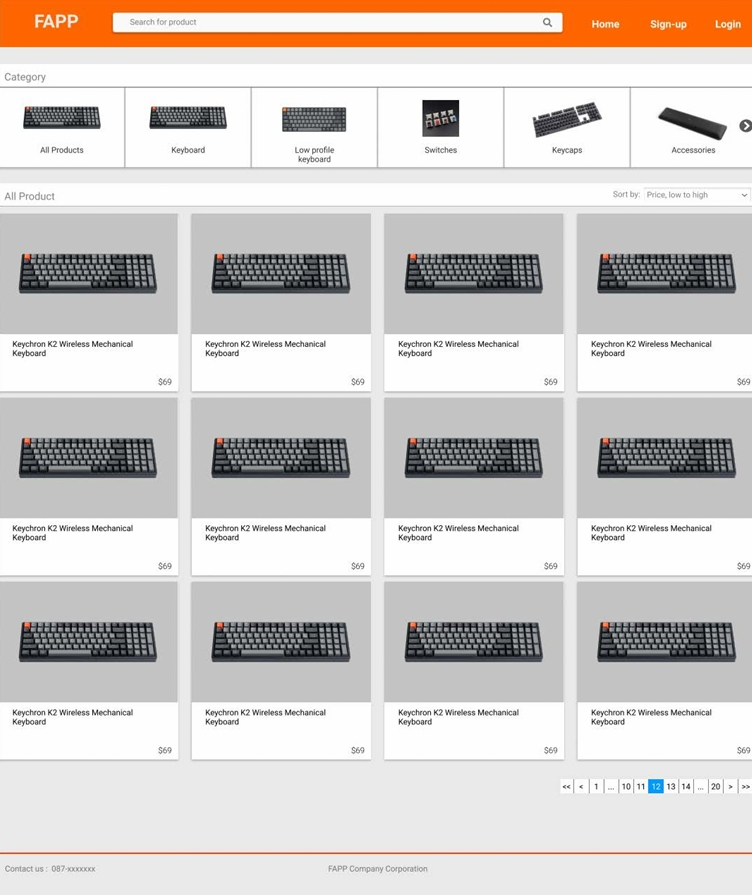
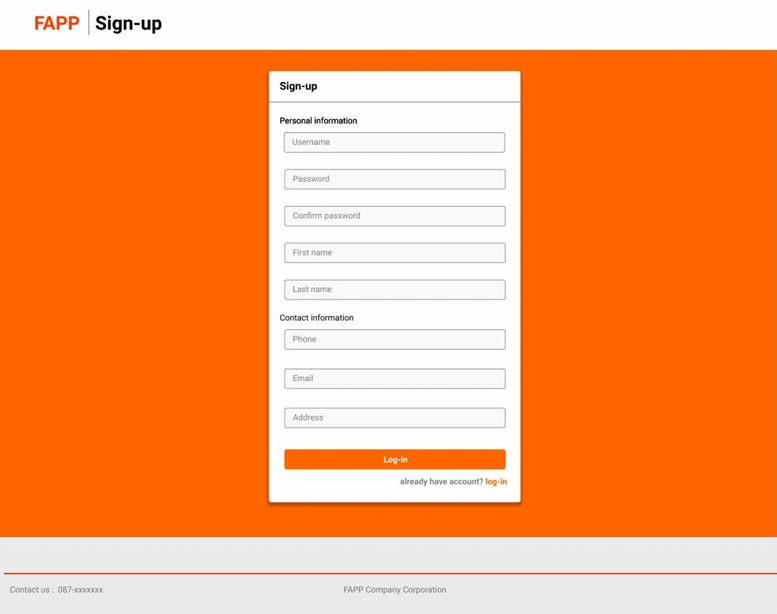
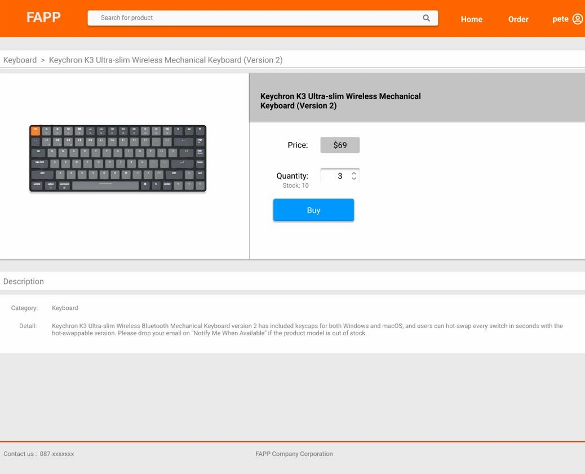
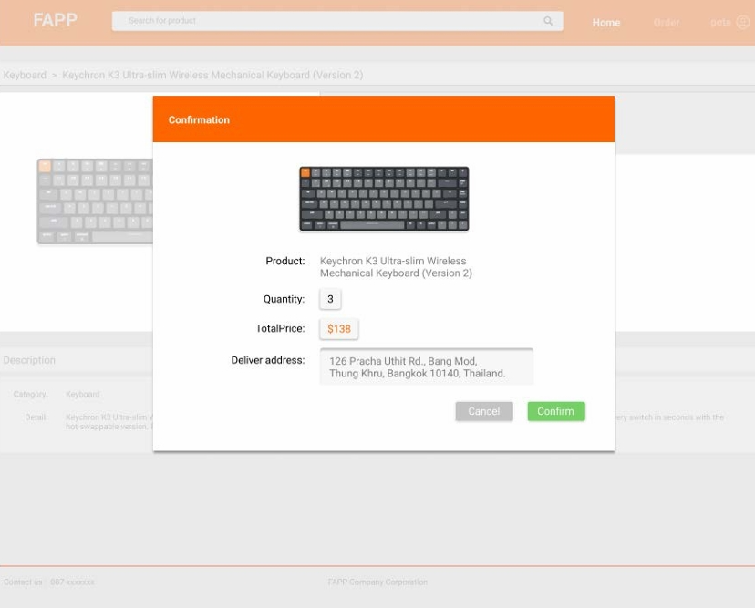
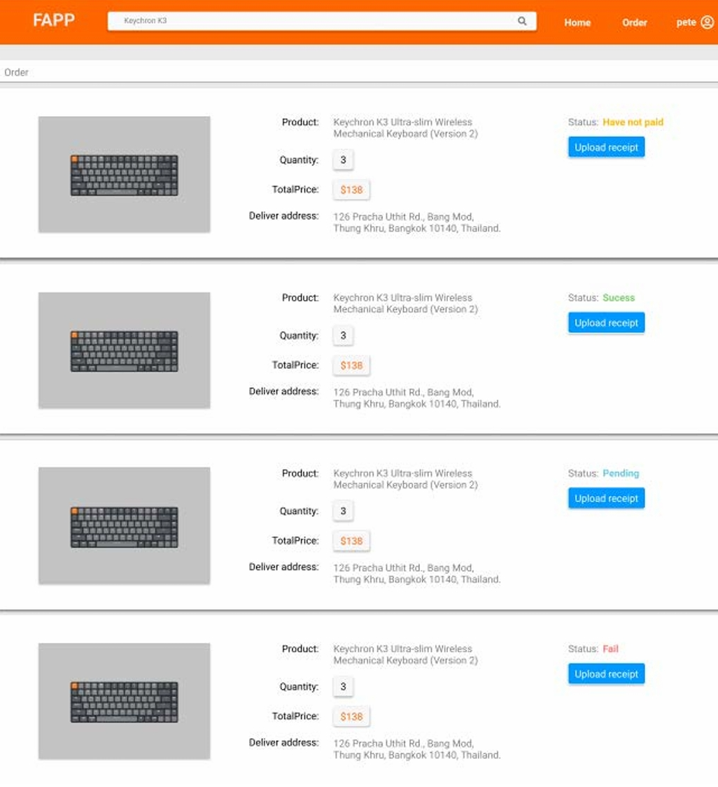
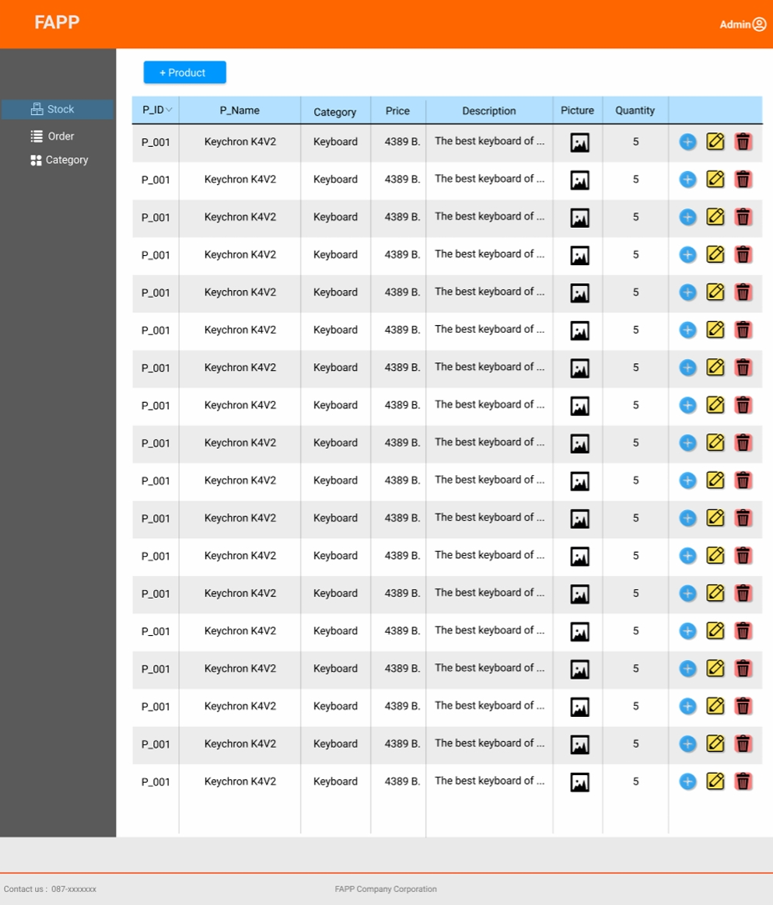

# SE4WIN-Project (E-commerce Web Application)

## Overview
This project, named FAPP, is an **online shopping system** designed to allow customers to browse and purchase products offered by the company.

The system is divided into three main user roles:
* **Guest User:** Can search for products, view product details, browse categories, and sort products, but cannot place orders.
* **Customer User:** Has the same Browse capabilities as a Guest User, but can also place orders, view order details, make payments via bank transfer, and upload payment evidence. (Requires registration and login).
* **Admin User:** Manages the system, including adding, editing, and deleting product information, product categories, and brands. The Admin also has the duty to confirm customer orders by verifying payment evidence.

---

## Key Features
* **User Authentication:**
    * System supports user sign-up with username, first name, email, and password.
    * Users must log in before purchasing products.
    * User profile page for personal information editing.
* **Product Management (for Users):**
    * View product listings.
    * Search for products.
    * Organize products by categories.
    * Sort product listings (e.g., by price, category).
* **Order & Payment (for Customers):**
    * Users can confirm orders and make product payments.
    * Payment via bank transfer and upload of payment slip.
* **Admin Features:**
    * Admin can check order statuses (e.g., pending payment, confirmed, completed, failed).
    * Admin can add new products and product details (name, description, price, category, stock quantity).
    * Admin can edit product information and stock quantity.
    * Admin can add/edit/delete product categories.

---

## Technologies Used
* **Front-end:** React, GraphQL (for API consumption), HTML, CSS
* **Back-end:** Nest.js
* **Database:** PostgreSQL (Note: Database setup is no longer active for live demo.)
* **Design Tools:** Figma

---

## My Role & Responsibilities
* **UX/UI Design:** Designing the user experience and user interface using **Figma**.
* **Front-end Mockup Development:** Implementing the web interface (frontend pages) based on the designed mock-ups using **React**.
* **Collaboration:** Working closely with the backend team to understand API structures and integrate frontend components. (Note: While I designed the frontend UI, the core logic and data connection with the backend were handled by other team members.)

---

## Screenshots

  
  
  _Homepage showing product listings and sorting options._

 

  
  
  _User registration page._

 

  
  
  _Detailed product view page._

 

  
  
  _Order confirmation pop-up window during the checkout process._

 

  
  
  _Customer's order history page displaying various order statuses (e.g., pending payment, success, pending, failed)._

 

  
  
  _Admin panel for managing product information (add, edit, delete)._

---

## Challenges & Lessons Learned
* **Adapting Design to Implementation:** Initial UI designs required minor adjustments when translating them into actual code using the chosen framework, highlighting the need for flexible design.
* **Team Collaboration & Tool Adoption:** Working in a team, some members were not yet proficient with certain development tools, requiring additional time for learning and coordination.
* **Data Consistency & Version Control:** As a Frontend developer, I encountered issues with incomplete or late-arriving data from the backend team. This often led to rework, potential conflicts, and challenges in managing version control effectively.
* **Importance of Defined Development Process:** Adhering to a structured software development process, including regular sprints and clear planning, significantly helps in tracking progress and prioritizing tasks.
* **Value of Cross-functional Communication:** Effective communication and early alignment between design and development teams are crucial for seamless integration and minimizing rework.
* **Necessity of Comprehensive Data Planning:** Thorough data planning and clear data contracts from the outset are essential to ensure smooth frontend-backend integration and reduce late-stage modifications.
* **Proficiency in Version Control:** Mastering version control tools and best practices is vital for managing team contributions and preventing conflicts, especially when dealing with evolving requirements.

---

## Setup
Please note that this project is no longer actively maintained or set up for live demonstration. The codebase is available for review, showcasing the application's structure and the technologies used. Due to the project's age and database configurations, running it locally may require significant setup and may not be feasible.

For a comprehensive understanding, please refer to the project's `Overview`, `Key Features`, `My Role & Responsibilities`, and the `Screenshots` provided.
